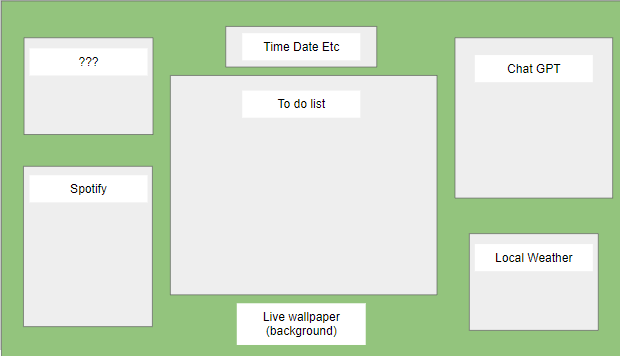

# Writers-Corner
Writers-Corner is the main title of our project. It is devided up into several sections.  Each section has a specific tool to help a student limit the distractions around them.  To do list, Spotify, Calculator and Local Weather are some of the sections.  
  
# table of contents
-User Story
-Acceptance Critera
-Technologies
-Other

## User Story
As students, we get easily distracted by outside factors, like gaming, sleeping, family, etc. So we will create an app to help silence the distractions, and focus on whatever we need to work on, by putting everything we need onto the page.

## Acceptance Critera
-Page has a to do list that will be saved in local storage
-Tell the local weather
-Tell the date and time
-Has a working spotify section?
-Able to click a button to change the background of the webpage
-Calculator section

### Technologies
-HTML
-CSS: 
-JavaScript
-API's 

#### Other
-status
Project in progress